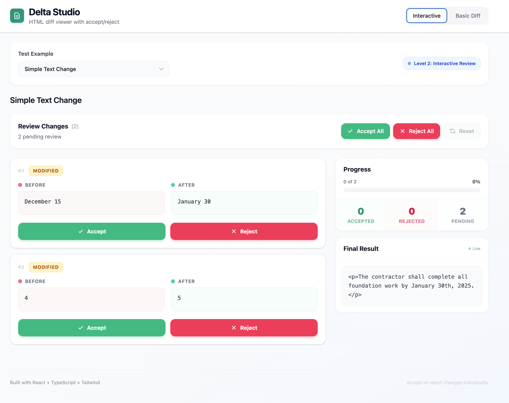

# Delta Studio

> Visual diff studio for HTML document comparison and merging


## Overview

Delta Studio is a modern, interactive diff viewer designed for comparing and merging structured HTML content. Built with clarity and user experience in mind, it makes reviewing document changes fast and intuitive.

Perfect for reviewing AI-generated document changes, collaborative editing workflows and version control systems.

## Features

### ✔ Level 1: Visual Diff Display


- Clear syntax highlighting for additions, deletions and modifications
- Raw HTML comparison with color-coded changes
- Clean, readable diff output similar to GitHub's code review

### ✔ Level 2: Interactive Review System



- **Accept/Reject Individual Changes** - Fine-grained control over each modification
- **Live Preview** - See final result update in real-time as you make decisions
- **Batch Operations** - Accept All, Reject All or Reset all changes at once
- **Progress Tracking** - Visual statistics showing accepted, rejected and pending changes
- **Before/After Comparison** - Side-by-side view makes understanding changes effortless

### 📝 Level 3: WYSIWYG Diff (Research Phase)

- Comprehensive research on HTML tree diffing algorithms
- Documented challenges with nested structures and DOM manipulation
- Proposed solution architecture for future implementation
- See [`docs/LEVEL3_RESEARCH.md`](./docs/LEVEL3_RESEARCH.md) for full details

## Demo

```typescript
// Simple usage
<InteractiveDiff
  original="<p>Original content</p>"
  modified="<p>Modified content</p>"
/>
```

## Tech Stack

- **Framework:** React 19 + TypeScript
- **Build Tool:** Vite (fast, modern development experience)
- **Styling:** Tailwind CSS (utility-first, responsive)
- **Diff Engine:** diff-match-patch (battle-tested by Google)
- **State Management:** React Hooks (useState, useMemo, useCallback)

## Getting Started

### Prerequisites

- Node.js 18+ and npm

### Installation

```bash
# Clone the repository
git clone https://github.com/anjola-adeuyi/delta-studio.git
cd delta-studio

# Install dependencies
npm install

# Start development server
npm run dev
```

Visit `http://localhost:5173` to see Delta Studio in action.

### Build for Production

```bash
# Build optimized production bundle
npm run build

# Preview production build locally
npm run preview
```

## Project Structure

```
delta-studio/
├── src/
│   ├── components/          # React components
│   │   ├── DiffViewer.tsx          # Level 1: Basic diff display
│   │   ├── InteractiveDiff.tsx     # Level 2: Main interactive component
│   │   ├── ChangeCard.tsx          # Individual change UI
│   │   └── PreviewPanel.tsx        # Final result preview
│   ├── hooks/               # Custom React hooks
│   │   └── useChangeManager.ts     # State management for changes
│   ├── lib/                 # Core business logic
│   │   └── diffEngine.ts           # Diff computation algorithms
│   ├── types/               # TypeScript type definitions
│   │   └── index.ts
│   ├── examples/            # Test cases and sample data
│   │   └── testCases.ts
│   ├── App.tsx              # Main application component
│   ├── main.tsx             # Application entry point
│   └── index.css            # Global styles
├── docs/
│   ├── DECISIONS.md                # Technical decisions log
│   └── LEVEL3_RESEARCH.md          # Level 3 research findings
├── PROJECT_NOTES.md                # Development context
└── README.md                       # This file
```

## Usage Examples

### Basic Diff Viewer (Level 1)

Display a simple before/after comparison with syntax highlighting:

```typescript
import { DiffViewer } from './components/DiffViewer';

function Example() {
  return (
    <DiffViewer
      original="<p>The quick brown fox</p>"
      modified="<p>The quick red fox</p>"
    />
  );
}
```

### Interactive Diff (Level 2)

Full interactive review system with accept/reject controls:

```typescript
import { InteractiveDiff } from './components/InteractiveDiff';

function Example() {
  return (
    <InteractiveDiff
      original={`
        <ul>
          <li>Item 1</li>
          <li>Item 2</li>
        </ul>
      `}
      modified={`
        <ul>
          <li>Item 1 (updated)</li>
          <li>Item 2</li>
          <li>Item 3 (new)</li>
        </ul>
      `}
    />
  );
}
```

### Custom Test Cases

Add your own HTML comparison examples:

```typescript
// src/examples/testCases.ts
export const testCases: HTMLComparison[] = [
  {
    name: 'My Custom Example',
    original: '<p>Original HTML</p>',
    modified: '<p>Modified HTML</p>',
  },
];
```

## Architecture

### State Management Flow

```
User Action (Accept/Reject)
    ↓
useChangeManager Hook
    ↓
Update Change State
    ↓
Compute Final HTML
    ↓
Re-render Preview Panel
```

### Diff Algorithm

1. **Parse Input** - Convert HTML strings to comparable format
2. **Compute Diffs** - Use diff-match-patch for word-level comparison
3. **Group Changes** - Cluster related additions/deletions
4. **Generate Change Objects** - Create stateful change items
5. **Apply User Decisions** - Reconstruct final HTML based on accept/reject

See [`docs/DECISIONS.md`](./docs/DECISIONS.md) for detailed technical rationale.

## Design Philosophy

### Core Principles

1. **Clarity First** - Make changes obvious at a glance

   - Color-coded additions (green) and deletions (red)
   - Clear before/after comparison
   - Visual feedback on user decisions

2. **User Control** - One decision per change

   - Individual accept/reject buttons
   - Batch operations for efficiency
   - Live preview of final result

3. **Pragmatic Engineering** - Ship working solutions

   - Focus on 80% use case (Level 1 + 2)
   - Research complex features (Level 3) before implementing
   - Iterate based on user feedback

4. **Honest Communication** - Document trade-offs
   - Explain why certain approaches were chosen
   - Acknowledge limitations and future improvements
   - Share research findings even for incomplete features

## Documentation

- **[Technical Decisions](./docs/DECISIONS.md)** - Why React? Why diff-match-patch? All architecture choices explained
- **[Level 3 Research](./docs/LEVEL3_RESEARCH.md)** - Deep dive into WYSIWYG HTML diffing challenges

## Roadmap

### Short-term (Next Sprint)

- [ ] Keyboard shortcuts (j/k for navigation, y/n for accept/reject)
- [ ] Accessibility improvements (ARIA labels, screen reader support)
- [ ] Dark mode support

### Medium-term (Next Month)

- [ ] Batch selection for multiple changes
- [ ] Undo/redo functionality with change history
- [ ] Virtual scrolling for documents with 100+ changes
- [ ] Export final result to file (HTML, Markdown, etc.)

### Long-term (Future)

- [ ] Level 3: WYSIWYG rendering with preserved formatting
- [ ] Real-time collaborative review
- [ ] Backend integration for persistence
- [ ] Plugin system for custom diff strategies

## Performance

- **Fast Initial Load:** < 100ms for typical documents
- **Efficient Diffing:** Handles 1000+ word documents smoothly
- **Optimized Re-renders:** Uses React.memo and useMemo for expensive calculations
- **Responsive UI:** Smooth interactions even with many changes

## Browser Support

- Chrome/Edge (latest)
- Firefox (latest)
- Safari (latest)
- Mobile browsers (iOS Safari, Chrome Mobile)

## Contributing

Contributions are welcome! Please feel free to submit a Pull Request.

### Development Guidelines

1. Keep components focused and single-purpose
2. Use TypeScript strictly (no `any` types)
3. Write meaningful commit messages
4. Document non-obvious decisions
5. Test with multiple HTML examples

## License

MIT License, see [LICENSE](./LICENSE) file for details

## Acknowledgments

- Built with [React](https://react.dev/)
- Powered by [diff-match-patch](https://github.com/google/diff-match-patch)
- Styled with [Tailwind CSS](https://tailwindcss.com/)
- Developed for [Breek](https://www.breek.ai/)

---

**Built with ❤️ by [Anjolaoluwa Joshua Adeuyi](https://www.anjolaadeuyi.com/)**
