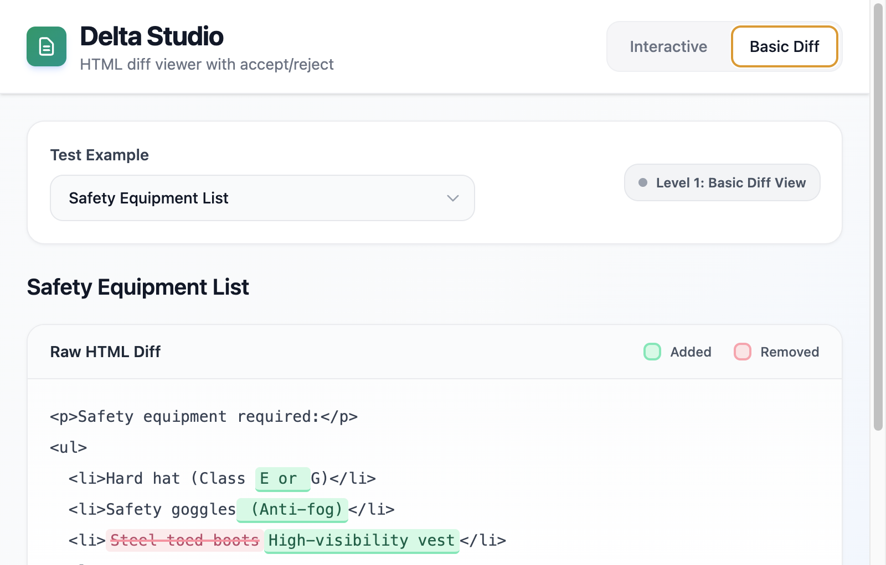
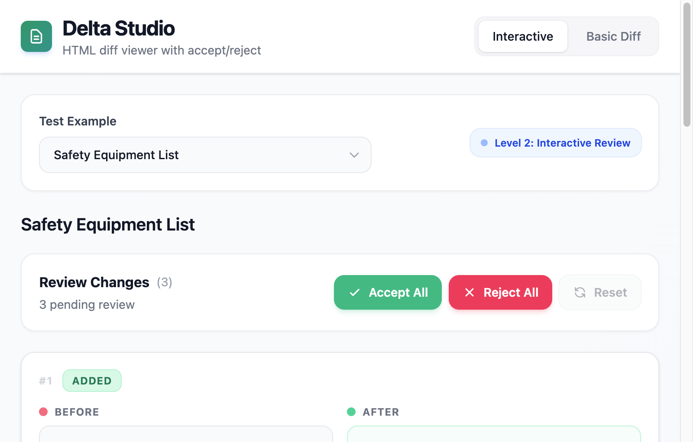
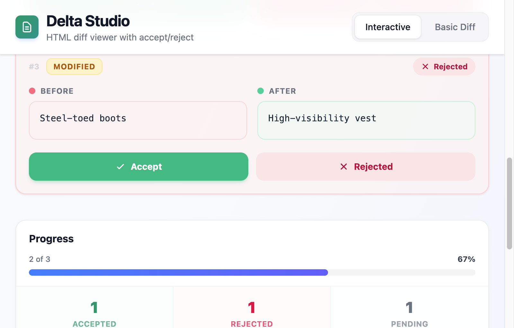

# Delta Studio, Visual Support Document

> Comprehensive visual documentation for technical discussion with Martin

---

## 📊 Technical Architecture

### Component Hierarchy

```
┌─────────────────────────────────────────────────────────────────┐
│                           App.tsx                               │
│  ┌───────────────────────────────────────────────────────────┐  │
│  │                      Header                               │  │
│  │  [Logo] [Title] [Mode Toggle: Interactive | Basic Diff]   │  │
│  └───────────────────────────────────────────────────────────┘  │
│                                                                 │
│  ┌───────────────────────────────────────────────────────────┐  │
│  │                   Controls Bar                            │  │
│  │  [Test Example Dropdown ▼]  [Level Badge]                 │  │
│  └───────────────────────────────────────────────────────────┘  │
│                                                                 │
│  ┌─────────────────────────┐  ┌─────────────────────────────┐   │
│  │                         │  │                             │   │
│  │   mode === 'basic'      │  │   mode === 'interactive'    │   │
│  │         ?               │  │           ?                 │   │
│  │                         │  │                             │   │
│  │   ┌─────────────────┐   │  │   ┌─────────────────────┐   │   │
│  │   │   DiffViewer    │   │  │   │  InteractiveDiff    │   │   │
│  │   │                 │   │  │   │                     │   │   │
│  │   │ • computeDiff() │   │  │   │ • useChangeManager  │   │   │
│  │   │ • Color-coded   │   │  │   │ • ChangeCard[]      │   │   │
│  │   │   highlighting  │   │  │   │ • PreviewPanel      │   │   │
│  │   └─────────────────┘   │  │   └─────────────────────┘   │   │
│  │                         │  │                             │   │
│  └─────────────────────────┘  └─────────────────────────────┘   │
│                                                                 │
│  ┌───────────────────────────────────────────────────────────┐  │
│  │                       Footer                              │  │
│  └───────────────────────────────────────────────────────────┘  │
└─────────────────────────────────────────────────────────────────┘
```

### Level 2 Component Detail

```
┌─────────────────────────────────────────────────────────────────┐
│                      InteractiveDiff                            │
│  ┌───────────────────────────────────────────────────────────┐  │
│  │  Batch Actions: [✓ Accept All] [✗ Reject All] [↺ Reset]   │  │
│  └───────────────────────────────────────────────────────────┘  │
│                                                                 │
│  ┌────────────────────────────┐  ┌────────────────────────────┐ │
│  │       Changes List         │  │      PreviewPanel          │ │
│  │         (2/3)              │  │         (1/3)              │ │
│  │                            │  │                            │ │
│  │  ┌──────────────────────┐  │  │  ┌──────────────────────┐  │ │
│  │  │    ChangeCard #1     │  │  │  │   Progress Card      │  │ │
│  │  │  ┌────────┬────────┐ │  │  │  │  ┌──────────────────┐│  │ │
│  │  │  │ BEFORE │ AFTER  │ │  │  │  │  │ Progress: 67%    ││  │ │
│  │  │  │ (red)  │(green) │ │  │  │  │  │ ████████░░░░░░░  ││  │ │
│  │  │  └────────┴────────┘ │  │  │  │  └──────────────────┘│  │ │
│  │  │  [✓ Accept][✗ Reject]│  │  │  │                      │  │ │
│  │  └──────────────────────┘  │  │  │  ┌────┬────┬────┐    │  │ │
│  │                            │  │  │  │ 1  │ 1  │ 1  │    │  │ │
│  │  ┌──────────────────────┐  │  │  │  │ ✓  │ ✗  │ ○  │    │  │ │
│  │  │    ChangeCard #2     │  │  │  │  └────┴────┴────┘    │  │ │
│  │  │         ...          │  │  │  └──────────────────────┘  │ │
│  │  └──────────────────────┘  │  │                            │ │
│  │                            │  │  ┌──────────────────────┐  │ │
│  │  ┌──────────────────────┐  │  │  │   Final Result       │  │ │
│  │  │    ChangeCard #3     │  │  │  │  ┌──────────────────┐│  │ │
│  │  │         ...          │  │  │  │  │ <p>Safety...</p> ││  │ │
│  │  └──────────────────────┘  │  │  │  │ <ul>...</ul>     ││  │ │
│  │                            │  │  │  └──────────────────┘│  │ │
│  └────────────────────────────┘  │  └──────────────────────┘  │ │
│                                  └────────────────────────────┘ │
└─────────────────────────────────────────────────────────────────┘
```

---

## 🔄 State Flow Diagram

### User Interaction Flow

```
┌─────────────────────────────────────────────────────────────────┐
│                                                                 │
│    ┌──────────┐     ┌────────────┐     ┌──────────────────┐     │
│    │  User    │────▶│  Selects   │────▶│ parseChanges()   │     │
│    │  Action  │     │  Example   │     │ initializes      │     │
│    └──────────┘     └────────────┘     │ changes array    │     │
│                                        └────────┬─────────┘     │
│                                                 │               │
│                                                 ▼               │
│    ┌──────────────────────────────────────────────────────┐     │
│    │               useChangeManager Hook                  │     │
│    │  ┌────────────────────────────────────────────────┐  │     │
│    │  │  changes: Change[]                             │  │     │
│    │  │  [                                             │  │     │
│    │  │    { id: "change-0", accepted: null, ... },    │  │     │
│    │  │    { id: "change-1", accepted: true, ... },    │  │     │
│    │  │    { id: "change-2", accepted: false, ... }    │  │     │
│    │  │  ]                                             │  │     │
│    │  └────────────────────────────────────────────────┘  │     │
│    └──────────────────────────────────────────────────────┘     │
│                          │                                      │
│         ┌────────────────┼────────────────┐                     │
│         ▼                ▼                ▼                     │
│    ┌─────────┐     ┌──────────┐     ┌──────────┐                │
│    │ accept  │     │ reject   │     │ reset    │                │
│    │ Change  │     │ Change   │     │ Changes  │                │
│    └────┬────┘     └────┬─────┘     └────┬─────┘                │
│         │               │                │                      │
│         └───────────────┴────────────────┘                      │
│                         │                                       │
│                         ▼                                       │
│    ┌──────────────────────────────────────────────────────┐     │
│    │              useMemo: computeFinalHTML()             │     │
│    │                                                      │     │
│    │   changes + original + modified  ──▶  finalResult    │     │
│    └──────────────────────────────────────────────────────┘     │
│                         │                                       │
│                         ▼                                       │
│    ┌──────────────────────────────────────────────────────┐     │
│    │                  Re-render UI                        │     │
│    │  • ChangeCard backgrounds update (green/red/white)   │     │
│    │  • PreviewPanel shows new finalResult                │     │
│    │  • Stats update (accepted/rejected/pending)          │     │
│    └──────────────────────────────────────────────────────┘     │
│                                                                 │
└─────────────────────────────────────────────────────────────────┘
```

---

## 🔀 Data Transformation Pipeline

### From Raw HTML to Final Result

```
┌─────────────────────────────────────────────────────────────────┐
│                    DIFF ENGINE PIPELINE                         │
└─────────────────────────────────────────────────────────────────┘

STAGE 1: Input
────────────────
┌──────────────────────┐    ┌──────────────────────┐
│      Original        │    │      Modified        │
│  "<p>Class G</p>"    │    │  "<p>Class E</p>"    │
└──────────────────────┘    └──────────────────────┘
           │                           │
           └─────────────┬─────────────┘
                         │
                         ▼
STAGE 2: diff-match-patch
────────────────────────────
┌───────────────────────────────────────────────────────────────────┐
│  const dmp = new DiffMatchPatch();                                │
│  const diffs = dmp.diff_main(original, modified);                 │
│  dmp.diff_cleanupSemantic(diffs);                                 │
│                                                                   │
│  // Output: [[0, "<p>Class "], [-1, "G"], [1, "E"], [0, "</p>"]]  │
└───────────────────────────────────────────────────────────────────┘
                         │
                         ▼
STAGE 3: Transform to DiffPart[]
────────────────────────────────
┌─────────────────────────────────────────────────────────────────┐
│  [                                                              │
│    { value: "<p>Class ", added: false, removed: false },        │
│    { value: "G", added: false, removed: true },                 │
│    { value: "E", added: true, removed: false },                 │
│    { value: "</p>", added: false, removed: false }.             │
│  ]                                                              │
└─────────────────────────────────────────────────────────────────┘
                         │
           ┌─────────────┴─────────────┐
           │                           │
           ▼                           ▼
    ┌──────────────┐           ┌──────────────┐
    │   LEVEL 1    │           │   LEVEL 2    │
    │  DiffViewer  │           │ parseChanges │
    └──────────────┘           └──────────────┘
           │                           │
           ▼                           ▼
    ┌──────────────┐           ┌────────────────────────┐
    │ Color-coded  │           │ Change[]               │
    │ <span>s:     │           │ [                      │
    │ green=added  │           │   {                    │
    │ red=removed  │           │     id: "change-0",    │
    └──────────────┘           │     type: "modified",  │
                               │     original: "G",     │
                               │     modified: "E",     │
                               │     accepted: null     │
                               │   }                    │
                               │ ]                      │
                               └────────────────────────┘
                                       │
                                       ▼
                               ┌──────────────────┐
                               │ User Decisions:  │
                               │ accept/reject    │
                               └──────────────────┘
                                       │
                                       ▼
                               ┌────────────────────┐
                               │computeFinalHTML()  │
                               │                    │
                               │ If accepted:       │
                               │   use modified     │
                               │ If rejected:       │
                               │   keep original    │
                               └────────────────────┘
                                       │
                                       ▼
                               ┌────────────────────┐
                               │  Final HTML:       │
                               │  "<p>Class E</p>"  │
                               │  or                │
                               │  "<p>Class G</p>"  │
                               └────────────────────┘
```

---

## ⏱️ Time Allocation Chart

### Total: ~8.5 hours

```
┌─────────────────────────────────────────────────────────────────┐
│                     TIME ALLOCATION                             │
├─────────────────────────────────────────────────────────────────┤
│                                                                 │
│  Project Setup (0.5 hr)                                         │
│  █▌                                                             │
│  • Vite + React + TypeScript                                    │
│  • Tailwind CSS configuration                                   │
│  • Folder structure                                             │
│                                                                 │
│  Level 1: Basic Diff (2 hr)                                     │
│  ████████                                                       │
│  • Type definitions                                             │
│  • Test cases creation                                          │
│  • diff-match-patch integration                                 │
│  • DiffViewer component                                         │
│  • Initial App layout                                           │
│                                                                 │
│  Level 2: Interactive (4 hr)                                    │
│  ████████████████                                               │
│  • parseChanges() & computeFinalHTML()                          │
│  • useChangeManager hook                                        │
│  • ChangeCard component                                         │
│  • PreviewPanel component                                       │
│  • InteractiveDiff orchestration                                │
│  • Mode toggle & integration                                    │
│                                                                 │
│  Visual Polish (1 hr)                                           │
│  ████                                                           │
│  • Color refinement (emerald/rose)                              │
│  • Transitions & animations                                     │
│  • Mobile responsiveness                                        │
│  • Hover states                                                 │
│                                                                 │
│  Documentation (1 hr)                                           │
│  ████                                                           │
│  • DECISIONS.md                                                 │
│  • LEVEL3_RESEARCH.md                                           │
│  • README.md                                                    │
│  • Visual support document                                      │
│                                                                 │
├─────────────────────────────────────────────────────────────────┤
│  BREAKDOWN BY PERCENTAGE                                        │
│                                                                 │
│  ┌────────────────────────────────────────────────────────┐     │
│  │ Setup  ████  6%                                        │     │
│  │ L1     ████████████████  24%                           │     │
│  │ L2     ████████████████████████████████████████  47%   │     │
│  │ Polish ████████████  12%                               │     │
│  │ Docs   ████████████  12%                               │     │
│  └────────────────────────────────────────────────────────┘     │
│                                                                 │
└─────────────────────────────────────────────────────────────────┘
```

---

## 📸 Screenshots

### Level 1: Basic Diff Viewer



**Features shown:**

- Raw HTML with syntax highlighting
- Green highlighting for additions
- Red strikethrough for removals
- Clean monospace font display
- Legend explaining colors

---

### Level 2: Interactive Mode, Initial State



**Features shown:**

- Mode toggle in header
- Test example dropdown
- Batch action buttons (Accept All, Reject All, Reset)
- ChangeCard with Before/After comparison
- Type badges (ADDED, MODIFIED, REMOVED)

---

### Level 2: Mixed Decisions



**Features shown:**

- Accepted card (green background)
- Rejected card (rose/red background)
- Pending card (white background)
- Progress bar showing 67% reviewed
- Stats grid: 1 Accepted, 1 Rejected, 1 Pending

---

## 🎨 UX Design Sketches

### Level 1 Layout

```
┌─────────────────────────────────────────────────────────────────┐
│  ┌─────────────────────────────────────────────────────────┐    │
│  │ DELTA STUDIO                      [Interactive] [Basic] │    │
│  └─────────────────────────────────────────────────────────┘    │
│                                                                 │
│  ┌─────────────────────────────────────────────────────────┐    │
│  │ Test Example: [Safety Equipment List      ▼]            │    │
│  │                              ● Level 1: Basic Diff View │    │
│  └─────────────────────────────────────────────────────────┘    │
│                                                                 │
│  Safety Equipment List                                          │
│                                                                 │
│  ┌─────────────────────────────────────────────────────────┐    │
│  │ Raw HTML Diff                    ▢ Added  ▢ Removed     │    │
│  ├─────────────────────────────────────────────────────────┤    │
│  │                                                         │    │
│  │  <p>Safety equipment required:</p>                      │    │
│  │  <ul>                                                   │    │
│  │    <li>Hard hat (Class ███E or███ G)</li>               │    │
│  │    <li>Safety goggles ███(Anti-fog)███</li>             │    │
│  │    <li>███Steel-toed boots███ ███High-visibility███     │    │
│  │        ███vest███</li>                                  │    │
│  │  </ul>                                                  │    │
│  │                                                         │    │
│  │  ███ = green (added)                                    │    │
│  │  ███ = red strikethrough (removed)                      │    │
│  │                                                         │    │
│  └─────────────────────────────────────────────────────────┘    │
│                                                                 │
└─────────────────────────────────────────────────────────────────┘
```

### Level 2 Layout

```
┌───────────────────────────────────────────────────────────────────┐
│  ┌─────────────────────────────────────────────────────────┐      │
│  │ DELTA STUDIO                      [Interactive] [Basic] │      │
│  └─────────────────────────────────────────────────────────┘      │
│                                                                   │
│  ┌─────────────────────────────────────────────────────────┐      │
│  │ Test Example: [Safety Equipment List      ▼]            │      │
│  │                           ● Level 2: Interactive Review │      │
│  └─────────────────────────────────────────────────────────┘      │
│                                                                   │
│  ┌─────────────────────────────────────────────────────────┐      │
│  │ Review Changes (3)      [Accept All] [Reject All] [↺]   │      │
│  │ 3 pending review                                        │      │
│  └─────────────────────────────────────────────────────────┘      │
│                                                                   │
│  ┌──────────────────────────────────┐ ┌──────────────────────┐    │
│  │                                  │ │      PROGRESS        │    │
│  │  ┌────────────────────────────┐  │ │  ┌────────────────┐  │    │
│  │  │ #1  ▢ ADDED                │  │ │  │ 0 of 3  ░░░ 0% │  │    │
│  │  │  ┌────────┬────────────┐   │  │ │  └────────────────┘  │    │
│  │  │  │ BEFORE │   AFTER    │   │  │ │                      │    │
│  │  │  │(empty) │ E or       │   │  │ │  ┌───┬───┬───┐       │    │
│  │  │  └────────┴────────────┘   │  │ │  │ 0 │ 0 │ 3 │       │    │
│  │  │  [  ✓ Accept ] [ ✗ Reject] │  │ │  │ ✓ │ ✗ │ ○ │       │    │
│  │  └────────────────────────────┘  │ │  └───┴───┴───┘       │    │
│  │                                  │ │                      │    │
│  │  ┌────────────────────────────┐  │ ├──────────────────────┤    │
│  │  │ #2  ▢ ADDED                │  │ │     FINAL RESULT     │    │
│  │  │  ┌────────┬──────────────┐ │  │ │  ┌────────────────┐  │    │
│  │  │  │ BEFORE │   AFTER      │ │  │ │  │ <p>Safety...   │  │    │
│  │  │  │(empty) │ (Anti-fog)   │ │  │ │  │ <ul>           │  │    │
│  │  │  └────────┴──────────────┘ │  │ │  │   <li>Hard...  │  │    │
│  │  │  [  ✓ Accept ] [ ✗ Reject] │  │ │  │ </ul>          │  │    │
│  │  └────────────────────────────┘  │ │  └────────────────┘  │    │
│  │                                  │ │                      │    │
│  │  ┌────────────────────────────┐  │ │      ● Live          │    │
│  │  │ #3  ▢ MODIFIED             │  │ └──────────────────────┘    │
│  │  │  ┌────────┬──────────────┐ │  │                             │
│  │  │  │ BEFORE │   AFTER      │ │  │                             │
│  │  │  │ Steel- │ High-vis     │ │  │                             │
│  │  │  │ toed   │ vest         │ │  │                             │
│  │  │  └────────┴──────────────┘ │  │                             │
│  │  │  [  ✓ Accept ] [ ✗ Reject] │  │                             │
│  │  └────────────────────────────┘  │                             │
│  │                                  │                             │
│  └──────────────────────────────────┘                             │
│                                                                   │
└───────────────────────────────────────────────────────────────────┘
```

### ChangeCard States

```
┌─────────────────────────────────────────────────────────────────┐
│                    CHANGECARD STATES                            │
├─────────────────────────────────────────────────────────────────┤
│                                                                 │
│  PENDING (white background)                                     │
│  ┌───────────────────────────────────────────────────────────┐  │
│  │ #1  ▢ MODIFIED                                            │  │
│  │  ┌─────────────────┐  ┌─────────────────┐                 │  │
│  │  │     BEFORE      │  │      AFTER      │                 │  │
│  │  │   Class G       │  │    Class E      │                 │  │
│  │  └─────────────────┘  └─────────────────┘                 │  │
│  │  ┌─────────────────┐  ┌─────────────────┐                 │  │
│  │  │   ✓  Accept     │  │   ✗  Reject     │                 │  │
│  │  │   (green btn)   │  │   (red btn)     │                 │  │
│  │  └─────────────────┘  └─────────────────┘                 │  │
│  └───────────────────────────────────────────────────────────┘  │
│                                                                 │
│  ACCEPTED (green background)                                    │
│  ┌───────────────────────────────────────────────────────────┐  │
│  │ #1  ▢ MODIFIED                      ✓ Accepted            │  │
│  │  ┌─────────────────┐  ┌─────────────────┐                 │  │
│  │  │     BEFORE      │  │      AFTER      │                 │  │
│  │  │   Class G       │  │    Class E      │                 │  │
│  │  └─────────────────┘  └─────────────────┘                 │  │
│  │  ┌─────────────────┐  ┌─────────────────┐                 │  │
│  │  │   ✓  Accepted   │  │   ✗  Reject     │                 │  │
│  │  │   (disabled)    │  │   (active)      │                 │  │
│  │  └─────────────────┘  └─────────────────┘                 │  │
│  └───────────────────────────────────────────────────────────┘  │
│                                                                 │
│  REJECTED (rose/red background)                                 │
│  ┌───────────────────────────────────────────────────────────┐  │
│  │ #1  ▢ MODIFIED                      ✗ Rejected            │  │
│  │  ┌─────────────────┐  ┌─────────────────┐                 │  │
│  │  │     BEFORE      │  │      AFTER      │                 │  │
│  │  │   Class G       │  │    Class E      │                 │  │
│  │  └─────────────────┘  └─────────────────┘                 │  │
│  │  ┌─────────────────┐  ┌─────────────────┐                 │  │
│  │  │   ✓  Accept     │  │   ✗  Rejected   │                 │  │
│  │  │   (active)      │  │   (disabled)    │                 │  │
│  │  └─────────────────┘  └─────────────────┘                 │  │
│  └───────────────────────────────────────────────────────────┘  │
│                                                                 │
└─────────────────────────────────────────────────────────────────┘
```

---

## 🎯 Key UX Decisions

### Before/After Comparison

```
┌─────────────────────────────────────────────────────────────────┐
│                                                                 │
│  WHY SIDE-BY-SIDE?                                              │
│                                                                 │
│  ✓ Reduces eye movement (both visible at once)                  │
│  ✓ Clear spatial separation (left=old, right=new)               │
│  ✓ Color-coded headers (red dot=before, green dot=after)        │
│  ✓ Equal visual weight (same size boxes)                        │
│                                                                 │
│  vs. Alternatives:                                              │
│                                                                 │
│  ✗ Inline diff (like GitHub)                                    │
│    - Harder to scan for non-developers                          │
│    - Context switching between lines                            │
│                                                                 │
│  ✗ Unified view                                                 │
│    - Confusing for complex changes                              │
│    - Unclear what's old vs new                                  │
│                                                                 │
└─────────────────────────────────────────────────────────────────┘
```

### Color Semantics

```
┌─────────────────────────────────────────────────────────────────┐
│                                                                 │
│  COLOR PALETTE (Tailwind)                                       │
│                                                                 │
│  POSITIVE ACTIONS (Accept):                                     │
│  ┌────────────────────────────────────────────────────────┐     │
│  │  emerald-50   │ Card background when accepted          │     │
│  │  emerald-100  │ Button hover, badges                   │     │
│  │  emerald-500  │ Primary button, icons                  │     │
│  │  emerald-600  │ Button hover                           │     │
│  │  emerald-700  │ Text on light backgrounds              │     │
│  └────────────────────────────────────────────────────────┘     │
│                                                                 │
│  NEGATIVE ACTIONS (Reject):                                     │
│  ┌────────────────────────────────────────────────────────┐     │
│  │  rose-50      │ Card background when rejected          │     │
│  │  rose-100     │ Button hover, badges                   │     │
│  │  rose-500     │ Primary button, icons                  │     │
│  │  rose-600     │ Button hover                           │     │
│  │  rose-700     │ Text on light backgrounds              │     │
│  └────────────────────────────────────────────────────────┘     │
│                                                                 │
│  NEUTRAL (Pending, Progress):                                   │
│  ┌────────────────────────────────────────────────────────┐     │
│  │  gray-50      │ Card background (pending)              │     │
│  │  gray-100     │ Input backgrounds                      │     │
│  │  gray-200     │ Borders                                │     │
│  │  gray-500     │ Secondary text                         │     │
│  │  gray-900     │ Primary text                           │     │
│  └────────────────────────────────────────────────────────┘     │
│                                                                 │
│  PROGRESS:                                                      │
│  ┌────────────────────────────────────────────────────────┐     │
│  │  blue-500 → indigo-500 │ Progress bar gradient         │     │
│  └────────────────────────────────────────────────────────┘     │
│                                                                 │
└─────────────────────────────────────────────────────────────────┘
```

---

## 📋 Summary

This visual support document provides:

1. **Technical Architecture** - Component hierarchy and relationships
2. **State Flow** - How user actions flow through the system
3. **Data Pipeline** - How HTML transforms through diffing stages
4. **Time Allocation** - Clear breakdown of development effort
5. **Screenshots** - Actual working application captures
6. **UX Sketches** - Design rationale and layout decisions
7. **Color Semantics** - Intentional use of color for meaning

---

_Created, December 2025_
